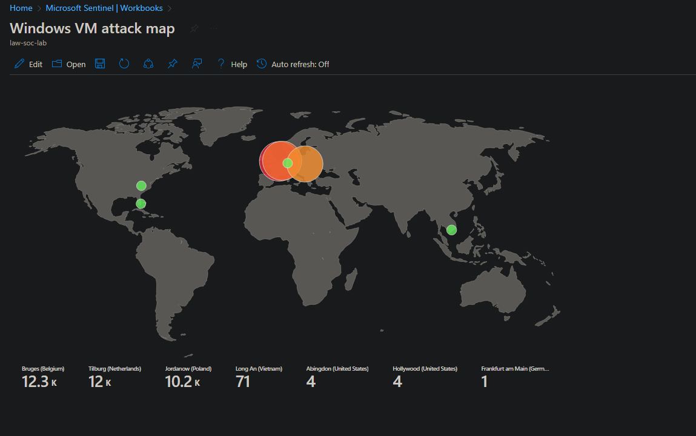
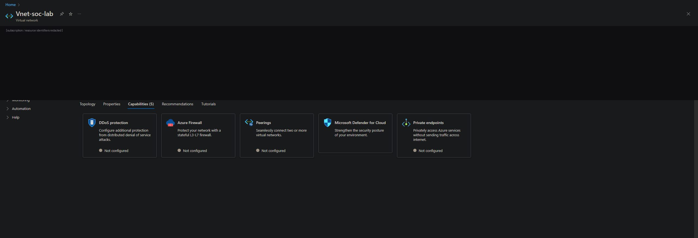
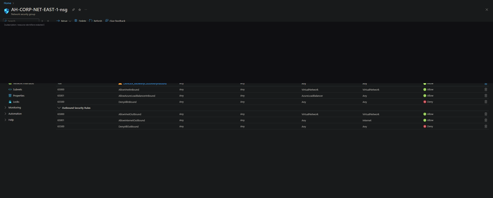
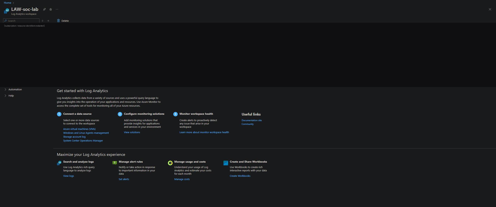
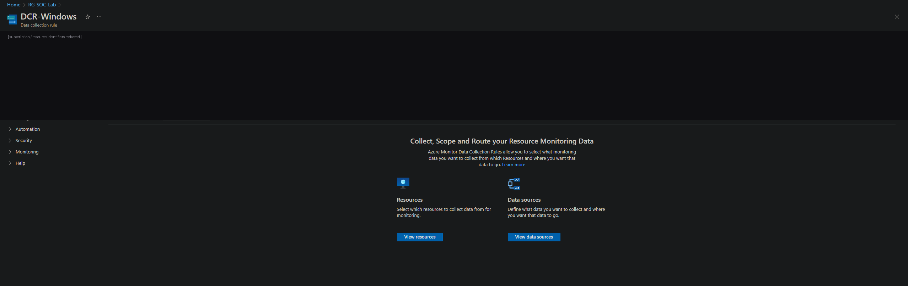
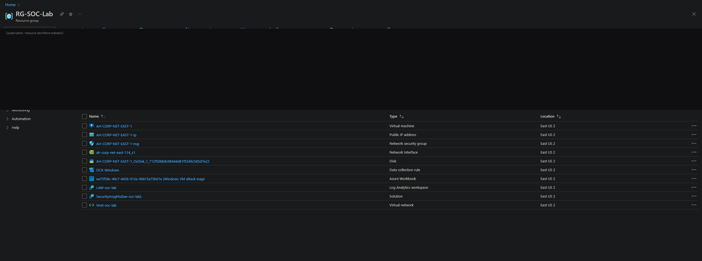

# Azure SOC Honeynet with Microsoft Sentinel

I put a deliberately exposed Windows host on the public internet, forwarded its security logs into
Microsoft Sentinel, and used KQL to hunt the attacks that followed. Failed logins were enriched
with GeoIP data and plotted on a live attack map. Within about a day the honeypot had logged tens
of thousands of failed logon attempts from around the world.

Full write-up with the build, the queries, and the analysis: [REPORT.md](REPORT.md).



> Top source regions in the sample run: Belgium (12.3K), Netherlands (12K), Poland (10.2K), plus
> Vietnam, Germany, and the US. Almost all of it automated.

## What it covers

- Azure IaaS: resource group, virtual network, network security group, a Windows VM
- Microsoft Sentinel running on a Log Analytics workspace
- A log pipeline: Azure Monitor Agent and a Data Collection Rule forwarding Windows Security events
- Threat hunting in KQL
- GeoIP enrichment with a Sentinel watchlist
- An attack-map workbook
- Windows security event analysis, focused on Event ID 4625 (failed logon)

## Architecture

```
                          PUBLIC INTERNET  (attackers, bots, brute-forcers)
                                   |
                                   v
        +--------------------------------------------------------------+
        |  Azure Subscription  >  Resource Group (RG-SOC-Lab)          |
        |                                                              |
        |   Virtual Network (10.0.0.0/16)                              |
        |     +------------------------------------------------+       |
        |     |  Windows VM "honeypot"                         |       |
        |     |   - Public IP, RDP exposed                     |       |
        |     |   - NSG: allow ANY/ANY/ANY inbound             |       |
        |     |   - Windows Firewall disabled (intentional)    |       |
        |     |   - Azure Monitor Agent (AMA)                  |       |
        |     +-----------------------+------------------------+       |
        |                             | Security event logs            |
        |                Data Collection Rule (DCR-Windows)            |
        |                             v                                |
        |             Log Analytics Workspace (LAW-soc-lab)           |
        |                             |                                |
        |                             v                                |
        |             Microsoft Sentinel  (SIEM)                       |
        |               - KQL hunting (Event ID 4625)                 |
        |               - GeoIP watchlist enrichment                  |
        |               - Workbook: "Windows VM attack map"           |
        +--------------------------------------------------------------+
```

### Stack

| Layer | Service / Tool |
|---|---|
| Cloud | Microsoft Azure (East US 2) |
| Compute | Windows 10 VM (honeypot) |
| Network | Virtual Network, Subnet, Network Security Group |
| Log collection | Azure Monitor Agent + Data Collection Rule |
| Log repository | Azure Log Analytics Workspace |
| SIEM | Microsoft Sentinel |
| Query language | KQL |
| Enrichment | GeoIP watchlist (IP range to lat/long/city/country) |
| Visualization | Sentinel Workbook |

## Build

1. Resource group, virtual network (`10.0.0.0/16`), and subnet. Nothing protecting it, on purpose.
   
2. A Windows VM with a public IP. I removed the default RDP-only inbound rule, replaced it with an
   allow-any rule, and turned off the Windows firewall so the host would be found and attacked fast.
   
3. A Log Analytics workspace as the central store, with the Azure Monitor Agent and a Data
   Collection Rule forwarding the VM's Windows Security events into it.
   
   
4. Microsoft Sentinel connected on top of the workspace, plus the full resource set.
   
5. Hunt failed logons in KQL, enrich the IPs against a GeoIP watchlist, and plot them in a workbook.

## KQL

Failed logons, Event ID 4625:

```kql
SecurityEvent
| where EventID == 4625
| project TimeGenerated, Computer, AttackerIP = IpAddress, Account, Activity
| sort by TimeGenerated desc
```

Enrich each attacker IP with the GeoIP watchlist and aggregate for the map:

```kql
let GeoIPDB = _GetWatchlist("geoip");
SecurityEvent
| where EventID == 4625
| evaluate ipv4_lookup(GeoIPDB, IpAddress, network)
| project
    TimeGenerated, Computer,
    AttackerIP       = IpAddress,
    City             = cityname,
    Country          = countryname,
    Latitude         = latitude,
    Longitude        = longitude,
    FriendlyLocation = strcat(cityname, " (", countryname, ")")
| summarize FailedAttempts = count()
    by AttackerIP, City, Country, FriendlyLocation, Latitude, Longitude
| sort by FailedAttempts desc
```

## What I found

- An exposed host gets attacked within minutes to hours. There was no warm-up period.
- The volume is relentless: tens of thousands of failed logons, with single source regions past 10K.
- The traffic is global and almost entirely automated, hitting the open RDP surface with common
  usernames.
- At that volume the raw event log is useless. Sentinel and KQL and a watchlist are what made the
  pattern legible.

## Next steps

This lab stops at detection and visualization. To push it toward a real SOC:

- Analytic rules that turn the 4625 spike into Sentinel incidents
- A SOAR playbook to auto-respond, for example blocking a source range
- Re-harden the NSG to least privilege and measure the drop in noise
- More telemetry: Sysmon and a Defender connector
- Map the activity to MITRE ATT&CK (the brute forcing is T1110)

## Safety

A honeypot is insecure on purpose. I kept it isolated, watched it the whole time it was up, and
tore it down when I was done. Do not run an allow-any host on a network you care about.

## Credit

Built following Josh Madakor's Azure SOC honeynet lab. The architecture and concept are his. The
deployment, configuration, queries, and analysis are mine.
